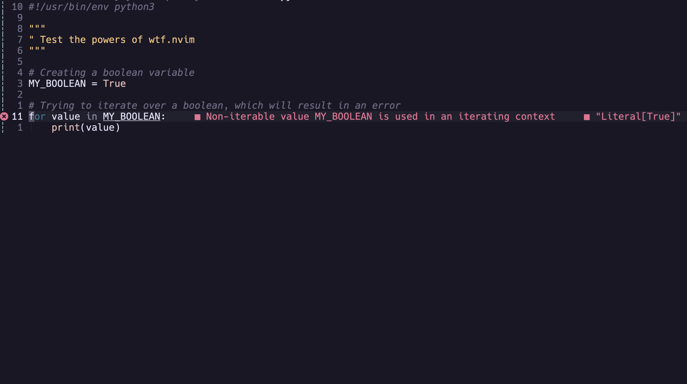
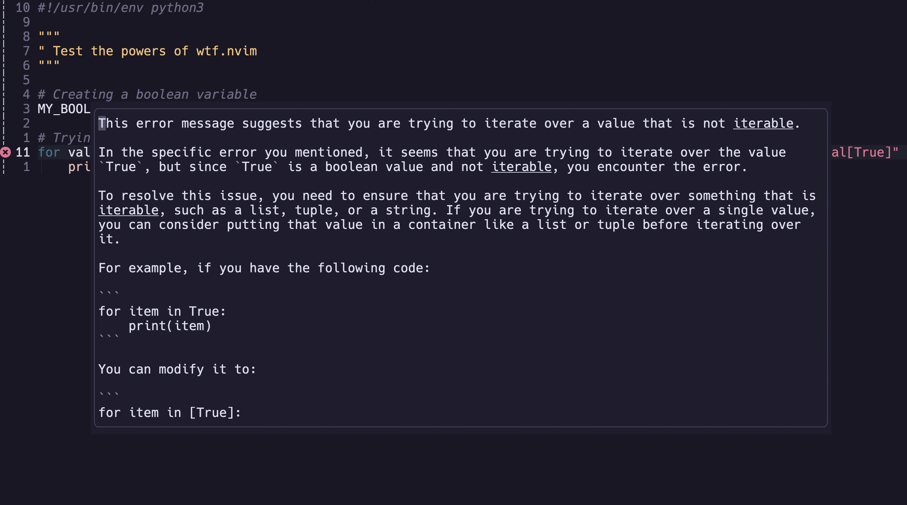
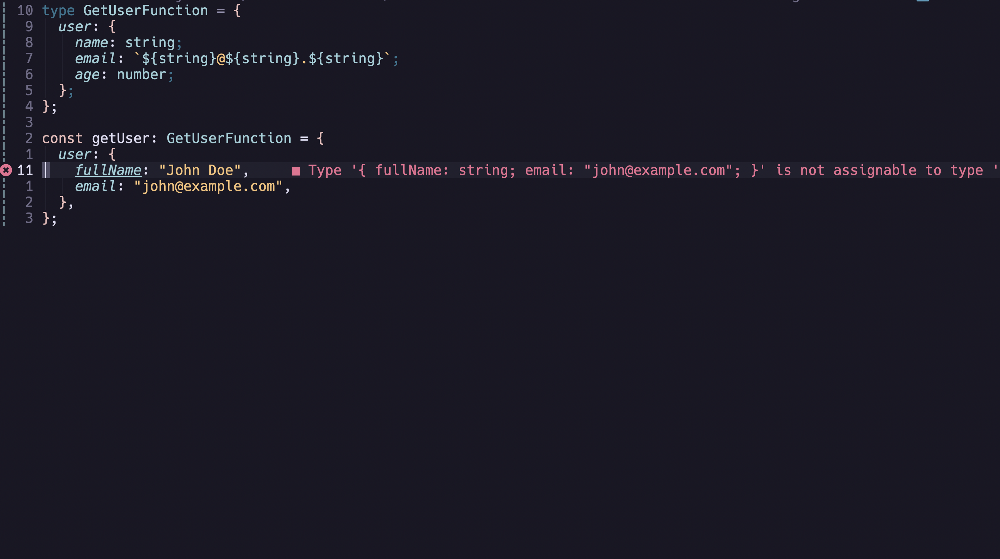
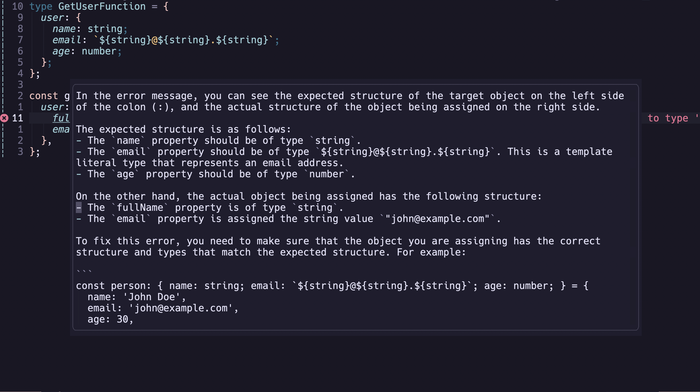
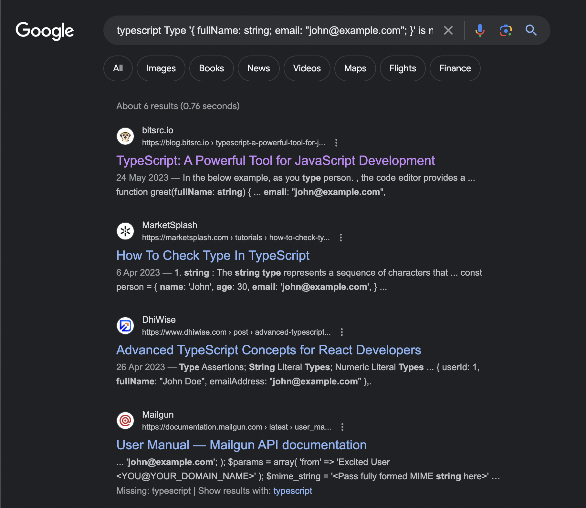

# wtf.nvim

Work out WTF that diagnostic means! wtf.nvim helps you debug and explain what LSP errors and warnings by sending the diagnostic to ChatGPT or searching the web for answers. wtf.nvim uses your code and context to provide more accurate solutions leading to quicker fixes. Works with any language that has LSP support in Neovim.

## Functionality

## AI powered diagnostic debugging

<table>
  <tr>
    <th>Python Before</th>
    <th>Python After</th>
  </tr>
  <tr>
    <td>
      
    </td>
    <td>
      
    </td>
  </tr>
  <tr>
    <th>Typescript Before</th>
    <th>Typescript After</th>
  </tr>
  <tr>
    <td>
      
    </td>
    <td>
      
    </td>
  </tr>
</table>

## Search the web for answers 



## Installation

If you want to use AI functionality, set the environment variable `OPENAI_API_KEY` to your [openai api key](https://platform.openai.com/account/api-keys).

Install the plugin with your preferred package manager:

[lazy.nvim](https://github.com/folke/lazy.nvim):

```
{
	"piersolenski/wtf.nvim",
	dependencies = {
		"dpayne/CodeGPT.nvim", -- Optional, if you want to use AI
	},
  	opts = {
        -- Default AI popup type
		popup_type = "popup" | "horizontal" | "vertical",
	},
	keys = {
		{
			"gw",
			mode = { "n" },
			function()
				require("wtf").ai()
			end,
			desc = "Debug diagnostic with AI",
		},
		{
			mode = { "n" },
			"gW",
			function()
				require("wtf").search()
			end,
			desc = "Search diagnostic with Google",
		},
	},
}
```

## Using

Whenever you have an error in an LSP enabled environment, invoke your keymap on that line.

## Inspiration

- [Pretty TypeScript Errors](https://github.com/yoavbls/pretty-ts-errors)
